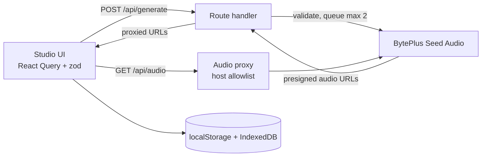

# Seed Audio Studio

A standalone Next.js web app for trying every **Seed Audio 1.5 (early access)** capability on BytePlus ModelArk: text to audio, reference voices, video to audio, video dubbing and stem separation.

> Seed Audio 1.5 early access is confidential. Keep this repository and everything generated with it private.

## Run it

```bash
npm install
cp .env.example .env.local
npm run dev
```

Set `SEED_AUDIO_API_KEY` in `.env.local` (the model ID and endpoint are pre-filled in `.env.example`). The key stays on the server and is never sent to the browser. Open http://localhost:3000.

| Variable | Purpose | Default |
|-|-|-|
| `SEED_AUDIO_API_KEY` | Bearer token supplied by BytePlus | required |
| `SEED_AUDIO_MODEL` | Endpoint ID (`ep-...`) | required |
| `SEED_AUDIO_ENDPOINT` | Generation URL | BytePlus ap-southeast |
| `SEED_AUDIO_MAX_CONCURRENCY` | In-flight requests the server allows (extra requests queue) | `2` |
| `SEED_AUDIO_AUDIO_HOSTS` | Extra hosts the audio proxy may fetch from (https only), comma separated | `.volces.com`, `.bytepluses.com` |
| `STUDIO_ACCESS_CODE` | When set, every page and API route requires this code (httpOnly session cookie) | off |

## Features

- **Five modes:** text to audio (optionally with one reference image), reference voice (1-6 clips), video to audio, video dubbing (30 languages, glossary) and stem separation, with every documented output option (format, sample rate, speed, volume, pitch) and quick presets.
- **Prompt tooling from the Seed Audio prompt guide:** a live prompt check (vague terms, missing exclusions, read-aloud guard, music balance, `@AudioN` tag mismatches, timeline timing and overlaps), a toolkit (voice designer, sound and music vocabulary, vocal actions, recording constraints, stem tracks), a timeline script builder, a prompt library and saved prompts with JSON export and import.
- **Reference audio handling:** drag and drop, microphone recording, automatic conversion of m4a, ogg, flac and webm to wav, trimming to 30 s, reordering, character labels and one-click tag insertion.
- **Jobs:** several generations at once and multiple takes per prompt, queued server-side. Jobs survive navigation, can be cancelled (which cancels the upstream request) and retried.
- **Developer tools:** exact request preview, copy as cURL, and the raw response of every result.
- **Players and history:** waveform players with speed control where only one plays at a time, and a local history with replay, re-run and download.
- **Verified against the live API:** the app's rules come from real early-access calls, not just the guide. A spoken line is mandatory, dubbing must not send a source language, and a reference image works only with plain text prompts. The API Reference page lists what was observed.
- **Validation:** one set of rules shared by the form and the server. Clip lengths (2-30 s, 2-360 s for separation), total reference length, request size and prompt-check errors block submission and appear live next to the field.

## Scripts

| Command | What it does |
|-|-|
| `npm run dev` | Dev server |
| `npm run build` / `npm start` | Production build and server |
| `npm test` | Vitest unit tests |
| `npm run typecheck` | `tsc --noEmit` |
| `npm run lint` | ESLint |

## How it works



- **Server-side key.** `/api/generate` validates the request with the shared zod schema, builds the upstream payload, and calls Seed Audio through a 2-slot queue that matches the key's concurrency limit.
- **Audio proxy.** Generated audio is served through `/api/audio`, which only fetches `https` URLs on allowlisted hosts and never follows redirects.
- **Browser storage.** History metadata lives in `localStorage` and the audio blobs in IndexedDB, because the API's presigned links expire after about a day. Nothing is stored on the server.
- **Access control.** Without `STUDIO_ACCESS_CODE`, anyone who can reach a deployment can spend the configured key, so run it locally or set a code. The code gate is a single shared secret, not per-user accounts, and it has no brute-force lockout, so put it behind your own access control for anything public.
- **Request size.** The API limits requests to 64 MB, so large uploads are validated against that before sending. Prefer public URLs for big files.

## Project layout

| Path | Contents |
|-|-|
| `src/app` | Pages (`/`, `/studio/*`, `/library`, `/history`) and API routes |
| `src/lib/seed-audio` | Shared constants, zod schemas, payload builder |
| `src/server` | Server-only env, limiter, upstream client, audio URL policy |
| `src/components` | Studio forms, waveform player, library, history, shell |
| `src/stores` | Zustand stores (history, preferences, transient draft) |
| `.agents/skills` | Agent skills: `seed-audio-api` and `seed-audio-prompt-15` |
| `tests/` | Unit tests for the Python helper script |
