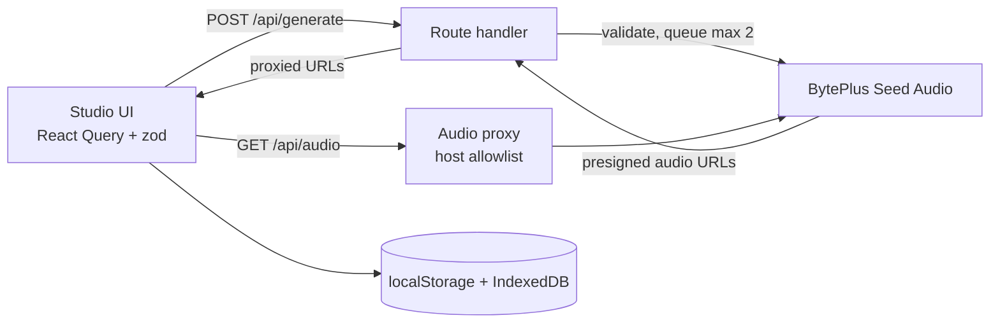

# Seed Audio Studio

A standalone Next.js web app for trying every **Seed Audio 1.5 (early access)** capability on BytePlus ModelArk: text to audio, reference voices, video to audio, video dubbing and stem separation.

> Seed Audio 1.5 early access is confidential. Keep this repository and everything generated with it private.

## Requirements

- Node.js 20.9 or newer and npm.
- **ffmpeg is optional** and only needed for the dubbed-video option. The app runs it as a short-lived command inside the same environment as the server, so **no separate container or service is needed**. The server looks for `FFMPEG_PATH`, then `ffmpeg` on `PATH`, then the bundled `ffmpeg-static` binary, so it works out of the box locally and on Vercel. Without any of them the option is disabled and everything else works.

## Run it

```bash
npm install
cp .env.example .env.local
npm run dev
```

Set `SEED_AUDIO_API_KEY` in `.env.local` (the model ID and endpoint are pre-filled in `.env.example`). The key stays on the server and is never sent to the browser. Open http://localhost:3000.

| Variable | Purpose | Default |
|-|-|-|
| `SEED_AUDIO_API_KEY` | Bearer token supplied by BytePlus | required |
| `SEED_AUDIO_MODEL` | Endpoint ID (`ep-...`) | required |
| `SEED_AUDIO_ENDPOINT` | Generation URL | BytePlus ap-southeast |
| `SEED_AUDIO_MAX_CONCURRENCY` | In-flight requests the server allows (extra requests queue) | `2` |
| `SEED_AUDIO_AUDIO_HOSTS` | Extra hosts the audio proxy may fetch from (https only), comma separated | `.volces.com`, `.bytepluses.com` |
| `FFMPEG_PATH` | Path to an ffmpeg binary that overrides `PATH` and the bundled one | auto |
| `STUDIO_ACCESS_CODE` | The app password. When set, every page and API route requires it (httpOnly session cookie). In production the app refuses to serve (503) while it is unset | required in production |
| `STUDIO_ALLOW_OPEN` | Set to `true` to serve a production build without a password, for example on a private network | off |

## Features

- **Dubbed video:** on Video Dubbing, optionally combine the dub with the original video into an mp4 that already has the new audio in place (the picture is copied, not re-encoded, when possible).
- **Five modes:** text to audio (optionally with one reference image), reference voice (1-6 clips), video to audio, video dubbing (30 languages, glossary) and stem separation, with every documented output option (format, sample rate, speed, volume, pitch) and quick presets.
- **Prompt tooling from the Seed Audio prompt guide:** a live prompt check (vague terms, missing exclusions, read-aloud guard, music balance, `@AudioN` tag mismatches, timeline timing and overlaps), a toolkit (voice designer, sound and music vocabulary, vocal actions, recording constraints, stem tracks), a timeline script builder, a prompt library and saved prompts with JSON export and import.
- **Reference audio handling:** drag and drop, microphone recording, automatic conversion of m4a, ogg, flac and webm to wav, trimming to 30 s, reordering, character labels and one-click tag insertion.
- **Jobs:** several generations at once and multiple takes per prompt, queued server-side. Jobs survive navigation, can be cancelled (which cancels the upstream request) and retried.
- **Developer tools:** exact request preview, copy as cURL, and the raw response of every result.
- **Players and history:** waveform players with speed control where only one plays at a time, and a local history with replay, re-run and download.
- **Verified against the live API:** the app's rules come from real early-access calls, not just the guide. A spoken line is mandatory, dubbing must not send a source language, and a reference image works only with plain text prompts. The API Reference page lists what was observed.
- **Validation:** one set of rules shared by the form and the server. Clip lengths (2-30 s, 2-360 s for separation), total reference length, request size and prompt-check errors block submission and appear live next to the field.

## Scripts

| Command | What it does |
|-|-|
| `npm run dev` | Dev server |
| `npm run build` / `npm start` | Production build and server |
| `npm test` | Vitest unit tests |
| `npm run typecheck` | `tsc --noEmit` |
| `npm run lint` | ESLint |

## How it works



- **Server-side key.** `/api/generate` validates the request with the shared zod schema, builds the upstream payload, and calls Seed Audio through a 2-slot queue that matches the key's concurrency limit.
- **Audio proxy.** Generated audio is served through `/api/audio`, which only fetches `https` URLs on allowlisted hosts and never follows redirects.
- **Browser storage.** History metadata lives in `localStorage` and the audio blobs in IndexedDB, because the API's presigned links expire after about a day. Nothing is stored on the server.
- **Access control.** A production build refuses to serve until `STUDIO_ACCESS_CODE` is set, because otherwise anyone who can reach the deployment could spend the configured key. Local development (`npm run dev`) stays open unless you set a code. The code gate is a single shared secret, not per-user accounts, and it has no brute-force lockout, so put it behind your own access control for anything public.
- **Dubbed video security.** `/api/mux` downloads the original video on the server, so it accepts only public `https` URLs, refuses private, loopback and cloud-metadata addresses (including after redirects), caps the download at 200 MB, passes ffmpeg its arguments without a shell, and always deletes its temporary files.
- **Request size.** The API limits requests to 64 MB, so large uploads are validated against that before sending. Prefer public URLs for big files.

## Deploying to Vercel

The app deploys to Vercel as is. Set `SEED_AUDIO_API_KEY` and `SEED_AUDIO_MODEL` (and `STUDIO_ACCESS_CODE`, because a public deployment lets anyone spend your key) in the project settings.

| Area | On Vercel |
|-|-|
| Generation, audio proxy, access gate | Work unchanged. Generation routes set `maxDuration = 300`, the Hobby maximum; raise it to 800 on Pro for very long jobs. |
| Dubbed video | Works. `ffmpeg-static` is bundled into `/api/mux` and `/api/status` (see `next.config.ts`). The dub audio is fetched by the server from its signed URL, so only the video link crosses the wire. Videos are capped at 200 MB and work in the writable `/tmp` (500 MB). |
| Uploads | Vercel rejects request bodies over 4.5 MB, so the form blocks larger uploaded clips and images and asks for a public URL instead. URLs have no such limit. |
| Concurrency | The 2-slot limiter lives in memory per function instance. Several instances can exceed the key's limit of 2, so expect occasional 429s from upstream under load. |
| Licence | `ffmpeg-static` ships a GPL build of ffmpeg. Check that it suits how you distribute the app. |

### CI and deploys

- `.github/workflows/ci.yml` runs lint, type check, tests and the build, plus the Python helper tests, on every pull request and push to `main`.
- `.github/workflows/deploy.yml` deploys `main` to production with the Vercel CLI after CI passes. It needs the repository secret `VERCEL_TOKEN` and the repository variables `VERCEL_ORG_ID` and `VERCEL_PROJECT_ID`, and skips itself when the token is missing.
- On a Hobby plan Vercel blocks deployments whose git commit author is not the account owner. `deploy.yml` therefore removes `.git` before deploying, and a manual deploy from a clean export has the same effect. Link the commit author's GitHub account to your Vercel account to avoid this.
- Alternatively, install the Vercel GitHub app for the repository and run `vercel git connect`. Vercel then deploys every push and creates previews for pull requests, and `deploy.yml` can be deleted.

## Project layout

| Path | Contents |
|-|-|
| `src/app` | Pages (`/`, `/studio/*`, `/library`, `/history`) and API routes |
| `src/lib/seed-audio` | Shared constants, zod schemas, payload builder |
| `src/server` | Server-only env, limiter, upstream client, audio URL policy |
| `src/components` | Studio forms, waveform player, library, history, shell |
| `src/stores` | Zustand stores (history, preferences, transient draft) |
| `.agents/skills` | Agent skills: `seed-audio-api` and `seed-audio-prompt-15` |
| `tests/` | Unit tests for the Python helper script |
